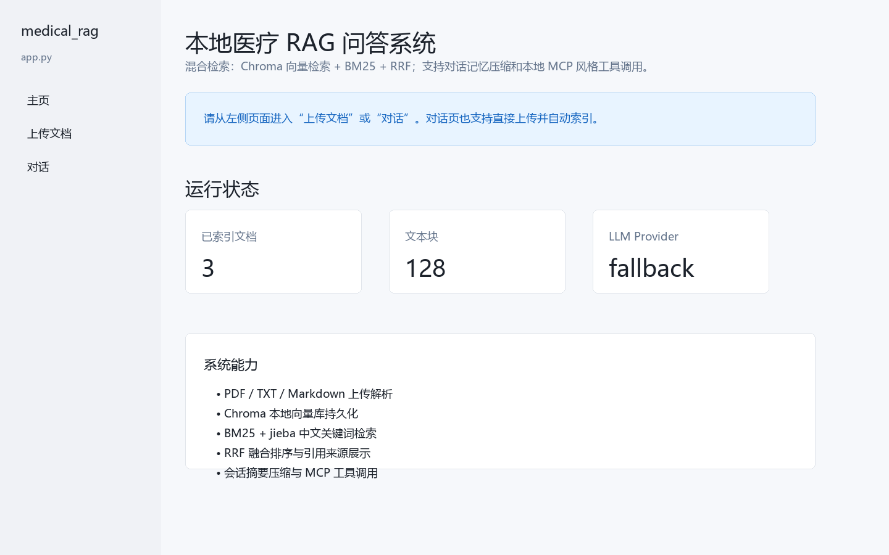
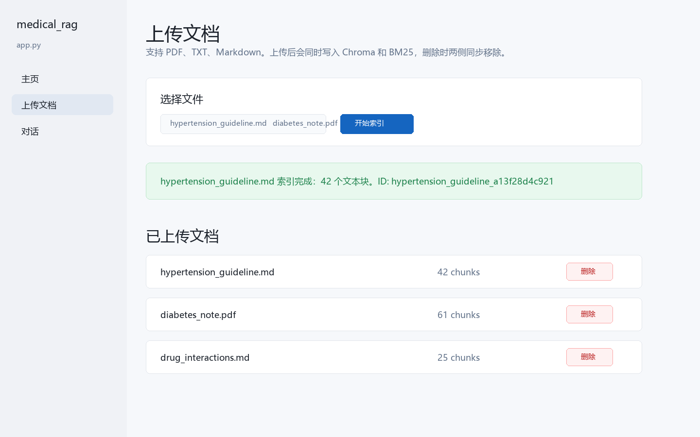
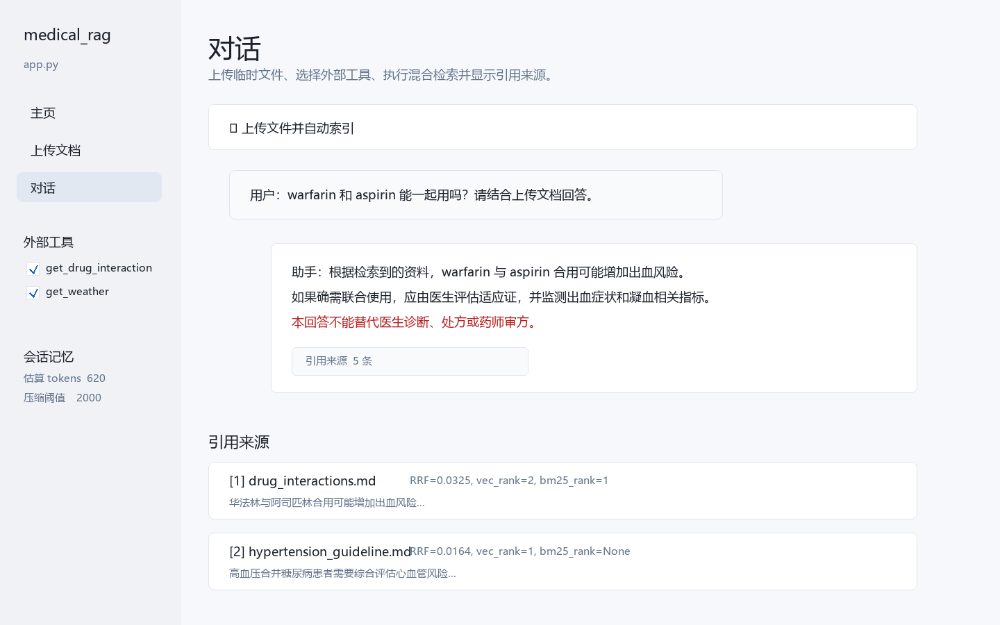

# Local Medical RAG QA System

一个基于 Streamlit 的本地医疗 RAG 问答系统，支持文档上传、Chroma 向量检索、BM25 关键词检索、RRF 排名融合、多轮对话记忆压缩，以及简化版 MCP Client 工具调用。

本项目适合作为本地知识库问答、医疗指南检索问答、RAG 教学演示和 MCP 工具调用原型。

> 医疗免责声明：本项目仅用于技术演示和学习研究，回答不能替代医生诊断、处方、药师审方、急诊处理或任何形式的专业医疗建议。

## 功能亮点

- 双页面 Streamlit 应用：上传文档页 + 对话页
- 对话页支持直接上传文件并自动索引
- 支持 PDF、TXT、Markdown 文档解析
- 文本分块默认 `chunk_size=500`，`chunk_overlap=50`
- 本地 embedding：默认 `BAAI/bge-small-zh-v1.5`
- Chroma `PersistentClient` 本地持久化向量库
- `jieba` 中文分词 + `rank_bm25` BM25 检索
- RRF Reciprocal Rank Fusion 融合向量检索与 BM25 结果
- 回答后显示引用来源、RRF 分数、向量排名和 BM25 排名
- 会话超过 token 阈值后自动摘要压缩，保留最近 2 轮原文
- 支持 Ollama、OpenAI 兼容接口、Azure OpenAI，也支持 fallback 模式验证检索链路
- 简化 MCP Client：支持 `list_tools()` 和 `call_tool()`
- 内置药物相互作用查询示例工具，可扩展外部 API 或本地 CSV

## 运行效果预览

### 首页状态面板



### 上传文档并建立索引



### 对话、混合检索、引用来源



## 技术架构

```text
用户问题
  |
  |-- Chroma 向量检索 top_k=10
  |-- BM25 关键词检索 top_k=10
  |
  v
RRF 融合排序 top_k=5
  |
  v
检索上下文 + 历史摘要 + 最近 2 轮对话 + 当前问题
  |
  v
LLM 流式生成
  |
  |-- 如检测到 <tool_call>...</tool_call>
  |-- MCPClient 调用外部/本地工具
  |
  v
最终回答 + 引用来源
```

## 项目结构

```text
medical_rag/
├── app.py                         # Streamlit 主入口
├── pages/
│   ├── 1_上传文档.py              # 文档上传、索引、删除
│   └── 2_对话.py                  # 聊天、直接上传、检索问答、工具开关
├── core/
│   ├── app_state.py               # Streamlit session_state 初始化与索引同步
│   ├── bm25_store.py              # BM25 索引维护与持久化
│   ├── config.py                  # config.yaml 加载与路径解析
│   ├── document_processor.py      # PDF/TXT/Markdown 解析与分块
│   ├── hybrid_retriever.py        # RRF 混合检索器
│   ├── llm_client.py              # Ollama/OpenAI/Azure/fallback LLM 封装
│   ├── mcp_client.py              # 简化 MCP Client 与 tool_call 解析
│   ├── memory_compressor.py       # 会话记忆压缩
│   └── vector_store.py            # Chroma 向量库封装
├── tools/
│   ├── drug_interaction.py        # 药物相互作用查询示例
│   └── weather.py                 # 工具扩展示例
├── data/
│   └── drug_interactions.csv      # 本地药物相互作用示例数据
├── docs/
│   └── screenshots/               # README 截图
├── config.yaml                    # 应用配置
├── requirements.txt               # Python 依赖
└── README.md
```

## 环境要求

- Python 3.10+
- Windows、macOS 或 Linux
- 推荐内存 8GB+
- 首次运行 sentence-transformers 会下载 embedding 模型
- 如果使用 Ollama，需要提前启动 Ollama 服务并拉取模型

## 安装

```bash
git clone https://github.com/Glorylife123/RAG_Item.git
cd RAG_Item

python -m venv .venv

# Windows
.venv\Scripts\activate

# macOS / Linux
source .venv/bin/activate

pip install -r requirements.txt
```

## 启动

```bash
streamlit run app.py
```

浏览器通常会打开：

```text
http://localhost:8501
```

## 配置说明

主要配置在 `config.yaml`。

```yaml
app:
  chroma_dir: "./chroma_db"
  bm25_path: "./data/bm25_store.json"
  chunk_size: 500
  chunk_overlap: 50
  vector_top_k: 10
  bm25_top_k: 10
  final_top_k: 5
  rrf_k: 60

embedding:
  model_name: "BAAI/bge-small-zh-v1.5"
```

### 使用 fallback 模式

默认配置：

```yaml
llm:
  provider: "fallback"
```

fallback 不调用真实大模型，但会展示检索到的上下文和 Prompt 构造结果，适合先验证上传、索引、RRF 和引用展示。

### 使用 Ollama

先启动 Ollama，并拉取模型：

```bash
ollama pull qwen2.5:7b
```

修改 `config.yaml`：

```yaml
llm:
  provider: "ollama"
  model: "qwen2.5:7b"
  ollama_base_url: "http://localhost:11434"
```

### 使用 OpenAI 兼容接口

```yaml
llm:
  provider: "openai"
  model: "gpt-4.1-mini"
  openai_api_key: "YOUR_API_KEY"
  openai_base_url: ""
```

如果你使用第三方 OpenAI 兼容网关，可以填写 `openai_base_url`。

### 使用 Azure OpenAI

```yaml
llm:
  provider: "azure_openai"
  azure_endpoint: "https://YOUR_RESOURCE.openai.azure.com"
  azure_api_key: "YOUR_API_KEY"
  azure_api_version: "2024-06-01"
  azure_deployment: "YOUR_DEPLOYMENT"
```

## 使用流程

1. 启动应用：`streamlit run app.py`
2. 打开左侧页面“上传文档”
3. 上传 PDF、TXT 或 Markdown 文件
4. 点击“开始索引”
5. 切换到“对话”页面
6. 输入医疗相关问题
7. 查看流式回答和引用来源
8. 如需临时补充知识，可在对话页展开“上传文件并自动索引”

## 混合检索与 RRF

系统同时运行两路检索：

- 向量检索：Chroma `similarity_search_with_score` 风格查询，返回 top 10
- BM25 检索：`jieba` 分词后使用 `rank_bm25.BM25Okapi`，返回 top 10

两路结果使用 RRF 融合：

```text
score(d) = sum(1 / (rrf_k + rank_r(d)))
```

其中：

- `rrf_k=60`
- `rank_r(d)` 是文档块在某一路检索中的排名
- 同时被向量检索和 BM25 命中的 chunk 通常会得到更高融合分
- 最终取融合后 top 5 作为上下文

核心实现位于：

```text
core/hybrid_retriever.py
```

## 如何测试 RRF 效果

可以准备一个 Markdown 测试文档：

```markdown
# 高血压合并糖尿病管理

高血压合并糖尿病患者通常需要综合评估心血管风险、肾功能和用药禁忌。
降压治疗应结合患者年龄、合并症和耐受性。

# 药物相互作用

华法林和阿司匹林合用可能增加出血风险，需要医生评估。
```

上传后分别提问：

```text
高血压合并糖尿病应该如何处理？
```

以及：

```text
warfarin 和 aspirin 能一起用吗？
```

在回答下方展开“引用来源”，观察：

- `RRF`
- `vec_rank`
- `bm25_rank`

如果某个 chunk 同时具有 `vec_rank` 和 `bm25_rank`，说明它被两路检索共同召回。

## 会话记忆压缩

默认配置：

```yaml
memory:
  max_tokens: 2000
  keep_recent_turns: 2
```

触发逻辑：

1. 系统估算当前会话 token 数
2. 超过阈值时，将早期对话交给 LLM 摘要
3. 保留最近 2 轮用户/助手原文
4. 后续 Prompt 包含历史摘要、最近对话和当前问题

快速测试方法：

```yaml
memory:
  max_tokens: 200
```

连续输入较长问题，页面会显示：

```text
已触发会话记忆压缩：早期对话已写入摘要，最近 2 轮原文保留。
```

## MCP Client 与工具调用

本项目实现的是简化版本地 MCP 风格工具注册表，接口包括：

```python
list_tools()
call_tool(tool_name, arguments)
```

LLM 可以输出如下标签：

```text
<tool_call>get_drug_interaction|{"drug_a":"warfarin","drug_b":"aspirin"}</tool_call>
```

系统会解析工具调用，执行本地工具，然后将工具结果注入上下文，让 LLM 生成最终回答。

内置药物相互作用示例：

```text
warfarin + aspirin
warfarin + ibuprofen
metformin + contrast media
simvastatin + clarithromycin
nitroglycerin + sildenafil
```

扩展新工具：

1. 在 `tools/` 下创建工具类
2. 添加 `name`、`description` 和 `run(arguments)`
3. 在 `core/mcp_client.py` 中注册
4. 在对话页侧边栏勾选启用

## 删除与缓存同步

每个文本块会使用同一个 `chunk_id` 写入 Chroma 和 BM25。

删除文档时：

- Chroma：按 `document_id` 删除 metadata 匹配的向量块
- BM25：删除 JSON 中对应 chunks，随后重建 BM25 索引

这样可以保证向量检索和 BM25 检索不会引用已经删除的文档。

## 常见问题

### 首次运行很慢

首次加载 embedding 模型时需要下载模型文件。下载完成后，后续 embedding 在本地运行。

### Chroma 或 sentence-transformers 安装失败

建议升级 pip：

```bash
python -m pip install --upgrade pip setuptools wheel
pip install -r requirements.txt
```

### 没有大模型 API 可以运行吗

可以。默认 fallback 模式可以验证文档上传、分块、检索、RRF、引用展示和工具解析链路，只是不会生成真正的医学自然语言回答。

### 如何清空知识库

关闭应用后删除：

```text
chroma_db/
data/bm25_store.json
```

然后重新启动并上传文档。

## 开发说明

轻量语法检查：

```bash
python -m compileall core pages app.py
```

RRF 最小测试：

```python
from core.hybrid_retriever import reciprocal_rank_fusion

vec = [
    {"chunk_id": "a", "document_id": "d", "filename": "demo.md", "text": "A", "rank": 1, "score": 0.1},
    {"chunk_id": "b", "document_id": "d", "filename": "demo.md", "text": "B", "rank": 2, "score": 0.2},
]
bm25 = [
    {"chunk_id": "b", "document_id": "d", "filename": "demo.md", "text": "B", "rank": 1, "score": 3.0},
    {"chunk_id": "c", "document_id": "d", "filename": "demo.md", "text": "C", "rank": 2, "score": 2.0},
]

print(reciprocal_rank_fusion(vec, bm25, rrf_k=60, top_k=3))
```

期望结果：`b` 排名第一，因为它同时被向量检索和 BM25 检索命中。

## License

本项目可作为学习和二次开发模板使用。实际医疗场景部署前，请补充数据合规、隐私保护、模型评估、人工审核和安全边界。
